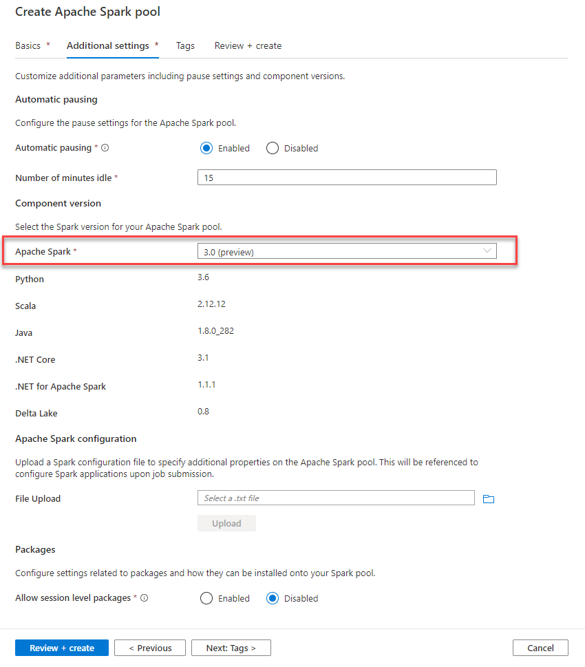

# Setup the Azure Synapse Analytics (ASA) workspace

## Task 1 - Create resources

1. Create a new resource group

2. In the resource group, create an empty Azure Synapse Analytics workspace.

3. Create the following containers in the primary storage account of the workspace: `dev`, `staging`, and `wwi`.

4. Create an Apache Spark pool named `SparkPool01`. Ensure Apache Spark version is set to 3.1.

    

5. Create a dedicated SQL Pool `sqlpool01` with 400 DW

6. Create new Linked Service `SQLPool1` pointing to the dedicated SQL Pool just created.

## Task 2 - Upload the data used in the exercises

1. Create a folder named `bronze` in the `dev` file system of `PrimaryStorage`.

2. Create a folder named `sentiment` in the `bronze` folder in the `dev` file system of `PrimaryStorage`.

3. Open web terminal in Azure Portal

4. Login to azcopy: `azcopy login --tenant-id YOUR_TENANT_ID`

5. Upload sample data file to your container: `azcopy copy https://solliancepublicdata.blob.core.windows.net/wwi-01/wwi-factsale.csv https://PRIMARY_STORAGE.blob.core.windows.net/dev/bronze/wwi-factsale.csv`

## Task 3 - Populate `PrimaryStorage` with data

1. Import the [Setup - Export Sales to Data Lake](./artifacts/00/notebooks/Setup%20-%20Export%20Sales%20to%20Data%20Lake.ipynb) notebook.

2. Replace `<primary_storage>` with the actual data lake account name of `PrimaryStorage` in cells 1, 3, 4 and 5.

3. Run the notebook to populate `PrimaryStorage` with data.

