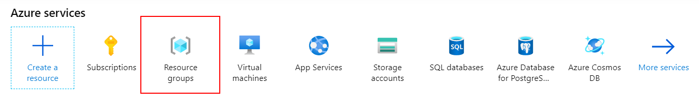
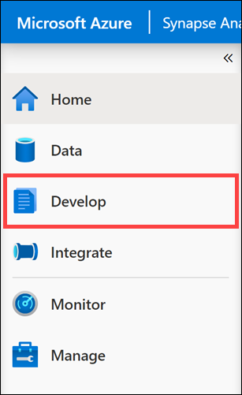

# Lab 1 - Explore the Data Lake with Azure Synapse Serverless SQL pool.

In this exercise, you will explore data using the SQL engine.

Understanding data through data exploration is one of the core challenges faced today by data engineers and data scientists. Depending on the data's underlying structure and the specific requirements of the exploration process, different data processing engines will offer varying degrees of performance, complexity, and flexibility.

In Azure Synapse Analytics, you can use either the SQL Serverless engine, the big-data Spark engine, or both.

## Task 1 - Explore the Data Lake with Azure Synapse serverless SQL pool

In this task, you will browse your data lake using serverless SQL pool.

1. In a Microsoft Edge web browser, navigate to the [Azure portal](https://portal.azure.com) (`https://portal.azure.com`) and login with your credentials. Then select **Resource groups**.

   

2. Select the **Synapse Analytics** resource group.

   

3. Select **SQLPool01** and **resume** it before starting the exercise.

   

   

4. Return to the resource group, then select the **Synapse Analytics** workspace.

   

5. On the Synapse workspace blade, open Synapse Analytics Studio by navigating to the **Workspace web URL** from the overview page.

   > You can also Open synapse studio by clicking on **Open** under **Getting started->Open synapse studio**

   

6. In Synapse Analytics Studio, navigate to the `Data` hub.

   

7. Switch to the **Linked** tab **(1)**. Under **Azure Data Lake Storage Gen2** **(2)**, expand the primary data lake storage account, and then select the **wwi** file system **(3)**.

   

8. Inside the selected file system, double-click to navigate to **factsale-parquet -> 2012 -> Q1 -> InvoiceDateKey=2012-01-01 (4)**.

9. Once you are in `InvoiceDateKey=2012-01-01` right-click the Parquet file **(1)** and select **New SQL script (2)** and **Select TOP 100 rows (3)**`.

   > A script is automatically generated. Run this script to see how serverless queries the file and returns the first 100 rows of that file with the header, allowing you to explore data in the file easily.

   

10. Ensure the newly created script is connected to the **Built-in (1)** pool representing serverless SQL pool and select **Run (2)**. Data is loaded by the built-in SQL pool and processed as if it came from any regular relational database.

    

    > For Parquet and Delta formats, serverless SQL uses automatic schema inference to determine the data types. This makes exploration of these datasets easy because you do not need to know the schema in advance.

11. Let us change the initial script to load multiple Parquet files at once.

    - In line 2, replace `TOP 100 *` with `COUNT(*)`.
    - In line 5, replace the path to the individual file with

    ```python
    https://<yourdatalake storage account name>.dfs.core.windows.net/wwi/factsale-parquet/2012/Q1/*/*
    ```

    > Note: Replace '< yourdatalake storage account name >' with the **Storage Account Name** provided in the environment details section on the Lab Environment tab on the right.

12. Select **Run** to re-run the script. You should see a result of `2991716`, which is the number of records contained in all the Parquet files within the `factsale-parquet/2012/Q1` directory.

    

13. In Azure Synapse Analytics Studio, navigate to the **Develop** hub.

    

14. Select the **Exercise 1 - Read with SQL on-demand** **(1)** SQL script. Connect to **Built-in (2)**. Select **Run (3)** to execute the script.

    

    > This query demonstrates the same functionality, except this time, it loads CSV files instead of Parquet ones (notice the `factsale-csv` folder in the path). Parquet files are compressed and store data in columnar format for efficient querying, compared to CSV files that are raw representations of data but easily processed by many systems. You can often encounter many file types stored in a data lake and must know how to access and explore those files. For instance, when you access CSV files, you need to specify the format, field terminator, and other properties to let the query engine understand how to parse the data. In this case, we determine the value of `2` for FIRSTROW. This indicates that the first row of the file must be skipped because it contains the column header.
    >
    > Here, we use WITH to define the columns in the files. You must use WITH on CSV data when using a bulk rowset (OPENROWSET) in the FROM clause. Also, defining the columns enables you to select and filter the values within.

15. Replace the contents of the SQL script with this query, and **replace** `YOUR_DATALAKE_NAME` with your **Storage Account Name** provided in the environment details section on the Lab Environment tab on the right. Select **Run** to execute the script. This query reads from Delta Lake format to calculate the 2012 quarterly sales quantity.

    ```sql
    SELECT 
     InvoiceYear,
     InvoiceQuarter,
     Sum(cast([Quantity] as int)) as SalesQuantity
    FROM
        OPENROWSET(
            BULK 'https://YOUR_DATALAKE_NAME.dfs.core.windows.net/wwi/factsale-deltalake',
       FORMAT = 'DELTA'
        ) AS [result]
    WHERE InvoiceYear=2012
    GROUP BY
         InvoiceYear,
         InvoiceQuarter
    ```

    > Delta Lake is a popular format when using Apache Spark for analytics. The schema and partitions are automatically inferred when you reference a folder containing the Delta Lake structure. The ability to read this data from your serverless SQL pool means you do not need to switch to Spark to query data that was loaded and saved to Delta Lake by Apache Spark jobs.

16. Update the cell with the following statements to create an external table for the quarterly results. **Replace** `YOUR_DATALAKE_NAME` with your **Storage Account Name** provided in the environment details section on the Lab Environment tab on the right. Select **Run** to execute the script.

    ```sql
    CREATE EXTERNAL DATA SOURCE WwiDataADLS
    WITH (LOCATION = 'abfss://wwi@YOUR_DATALAKE_NAME.dfs.core.windows.net') ;
    GO
    
    CREATE EXTERNAL FILE FORMAT CsvFormat
    WITH ( 
        FORMAT_TYPE = DELIMITEDTEXT, 
        FORMAT_OPTIONS ( FIELD_TERMINATOR = ',', STRING_DELIMITER = '"')
    );
    GO
    
    CREATE EXTERNAL TABLE QuarterlySales
    WITH (
        LOCATION = 'quarterly-sales',
        DATA_SOURCE = WwiDataADLS,
        FILE_FORMAT = CsvFormat
    )
    AS
    SELECT 
         InvoiceYear,
         InvoiceQuarter,
         Sum(cast([Quantity] as int)) as SalesQuantity
    FROM
        OPENROWSET(
            BULK 'https://YOUR_DATALAKE_NAME.dfs.core.windows.net/wwi/factsale-deltalake',
            FORMAT = 'DELTA'
        ) AS [result]
    WHERE InvoiceYear=2012
    GROUP BY
         InvoiceYear,
         InvoiceQuarter
    ```

    > This exports the results to CSV files in your data lake and defines a table schema that can be referenced directly in serverless SQL. You can test this by running `SELECT * FROM QuarterlySales`. The results are now easy to query from an analytics tools such as Power BI or you can download the files from the Data Lake..