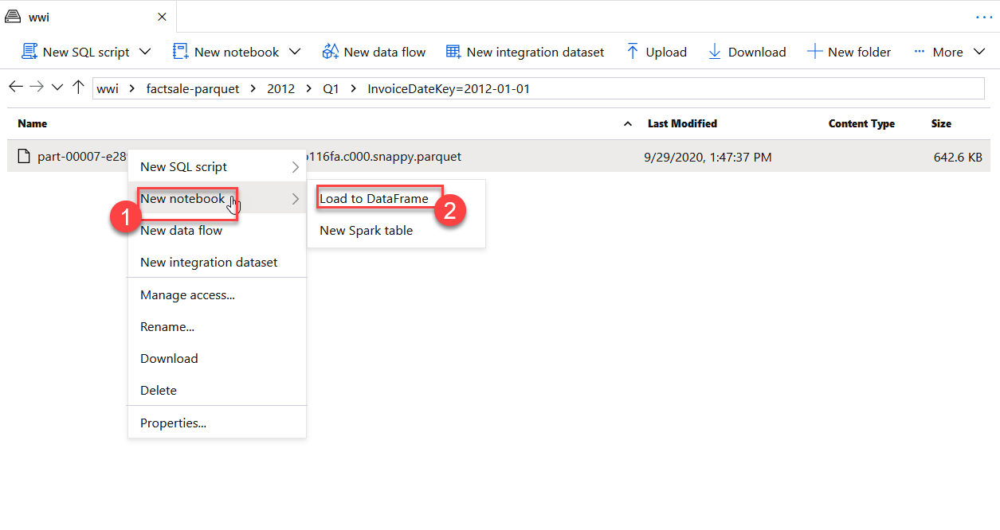
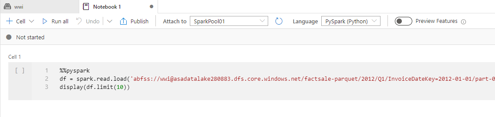
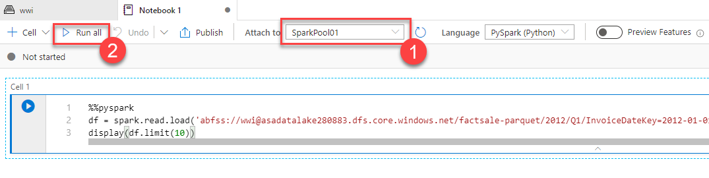
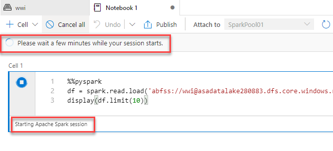
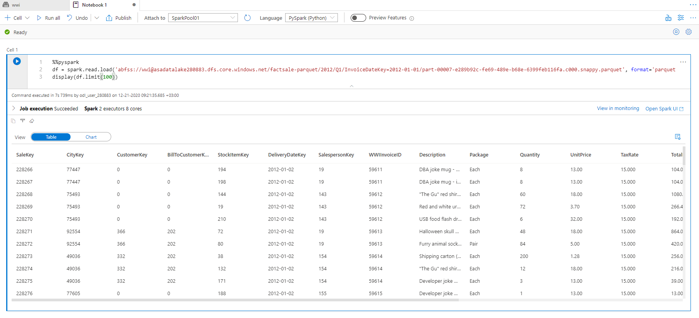
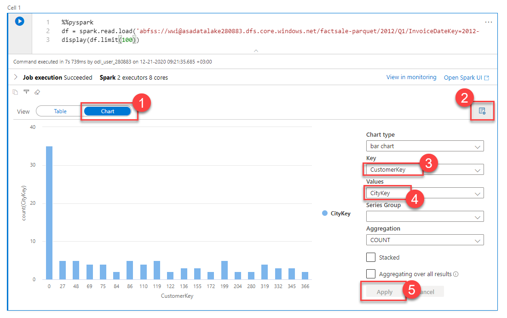
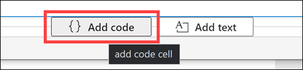
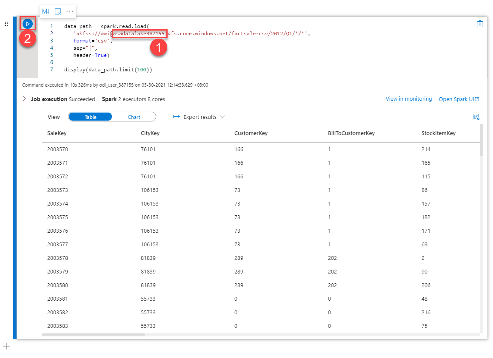
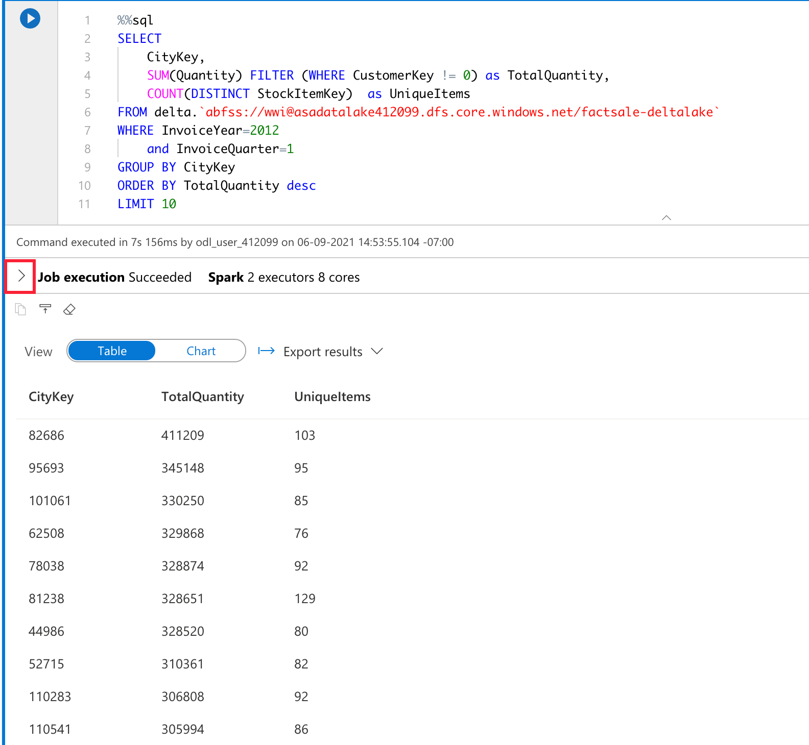
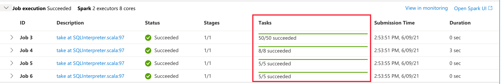

# Lab 2 - Explore the Data Lake with Azure Synapse Spark

In this exercise, you will explore data using the spark engine.

## Task 1 - Explore the Data Lake with Azure Synapse Spark

1. Navigate to the **Data** hub, browse to the data lake storage account folder `wwi/factsale-parquet/2012/Q1/InvoiceDateKey=2012-01-01`, then right-click the Parquet file and select **New notebook (1)** and **Load Data frame (2)**

   

2. This will generate a notebook with PySpark code to load the data in a dataframe and display 10 rows with the header.

   

3. Attach the notebook to a **Spark pool (1)**.

   

4. Select **Run all** on the notebook toolbar **(2)** to execute the notebook.

   > **Note**: The first time you run a notebook in a Spark pool, Synapse creates a new session. This can take approximately 3 minutes.

    

5. As you can see, the output of the dataframe is displayed with 10 rows. To  display 100 rows with the header, replace the last line of code with the following:

   ```python
   display(df.limit(100))
   ```

6. Re-run the notebook again to see the result.

   

7. Notice the included charting capabilities that enable visual exploration of your data. Switch to **Chart** view **(1)**. Select **View Options (2)** and change the **Key** to `CustomerKey` **(3)** and **Values** to `CityKey` **(4)**. Finally, select **Apply** to apply changes **(5)**.

    

8. Hover over the area just to the bottom of the cell in the notebook, then select **{} Add code** to add a new cell.

    

9. Paste the following into the cell, and **replace** `YOUR_DATALAKE_NAME` **(1)** with your **Storage Account Name** provided in the environment details section on the Lab Environment tab on the right. You can also copy it from the first cell of the notebook above.

   ```python
   data_path = spark.read.load(
      'abfss://wwi@YOUR_DATALAKE_NAME.dfs.core.windows.net/factsale-csv/2012/Q1/*/*',
      format='csv',
      sep="|",
      header=True)

   display(data_path.limit(100))
   ```

10. Select the **Run cell** button **(2)** to execute the new cell.

    

    > This notebook demonstrates the same functionality, except this time, it loads CSV files instead of Parquet ones (notice the `factsale-csv` folder in the path).

11. Add another cell and paste the following into the cell. Select the **Run cell** button to execute.This statement is setting configurations used by Apache Spark 3.1.

    ```python
    spark.conf.set("spark.sql.adaptive.enabled", "true")
    spark.conf.set("spark.sql.adaptive.coalescePartitions.enabled", "true")
    spark.conf.set("spark.sql.adaptive.coalescePartitions.minPartitionNum", 4)
    spark.conf.set("spark.sql.ansi.enabled", "true")
    ```

    > The Apache Spark pool for the exercise is using Spark 3.1, which provides performance benefits over previous versions. These configurations enable Adaptive Query Execution and set how Spark should optimize partitioning during job execution. ANSI SQL is also enabled to check for data type errors and overflow errors.

12. Add another cell and paste in the SQL statement to read from a Delta Lake path. Replace `YOUR_DATALAKE_NAME` with your **Storage Account Name**. Select the **Run cell** button to execute. This uses the magic command `%%sql` to change language of the cell to Spark SQL. The SQL statement returns the top 10 cities based on total quantity.

    ```sql
    %%sql
    SELECT 
        CityKey,
        SUM(Quantity) FILTER (WHERE CustomerKey != 0) as TotalQuantity,
        COUNT(DISTINCT StockItemKey) as UniqueItems
    FROM delta.`abfss://wwi@YOUR_DATALAKE_NAME.dfs.core.windows.net/factsale-deltalake`
    WHERE InvoiceYear=2012
        and InvoiceQuarter=1
    GROUP BY CityKey
    ORDER BY TotalQuantity desc
    LIMIT 10
    ```

    > Delta Lake is a popular format for storing data in a data lake since it supports upserts, deletes, and data versioning. You can access it using Spark SQL as shown here or by reading in as a DataFrame using `format(delta)`.

13. Expand the job execution summary by selecting the arrow next to **Job execution**.

    

    > The job execution shows the jobs, stages, and tasks that Spark ran when the cell was executed. This view shows duration and other performance characteristics that are important to consider if the notebook will be used repeatedly.

14. Notice the **Tasks** column shows the first job with 50 tasks as it reads in from files, then adjusts to 8 and then 5 tasks per job which is suitable for this small cluster and dataset. When running the same code with a larger dataset, Spark 3.1 can modify the query plan to be more efficient. In addition, you can enable autoscaling on your Apache Spark pool so it can automatically grow when the workload on the Spark pool increases.

    

    > Without Adaptive Query Execution enabled, the group by and order by in this cell would result in over 400 tasks. Spark 3.1 has improved on these tuning options and introduced additional performance benefits which may be noticed when joining datasets and working with skewed data.

15. **Important**: If you are continuing to Exercise 2 now, _leave this notebook open for the first task_ of the next exercise. This way, you can continue to use this notebook and the running Spark session, saving you time.
